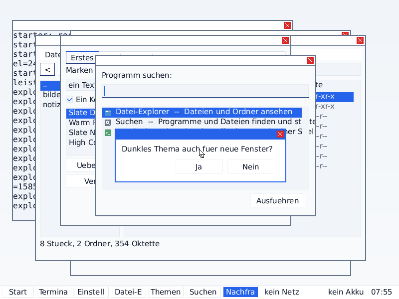
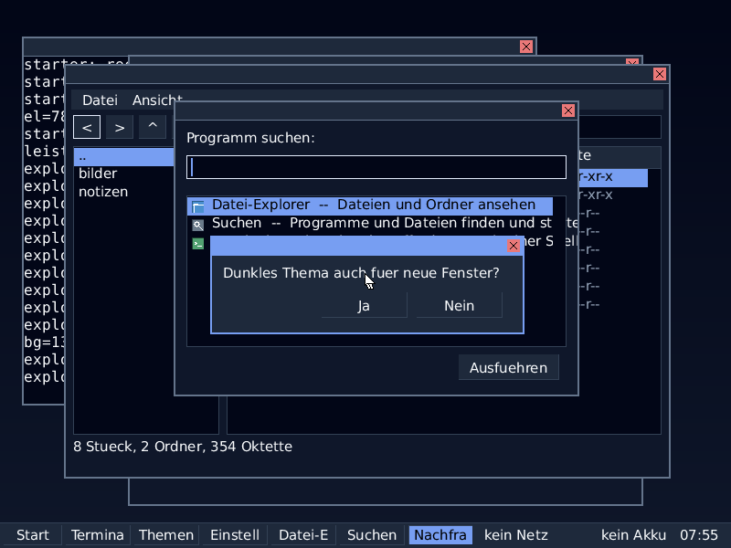
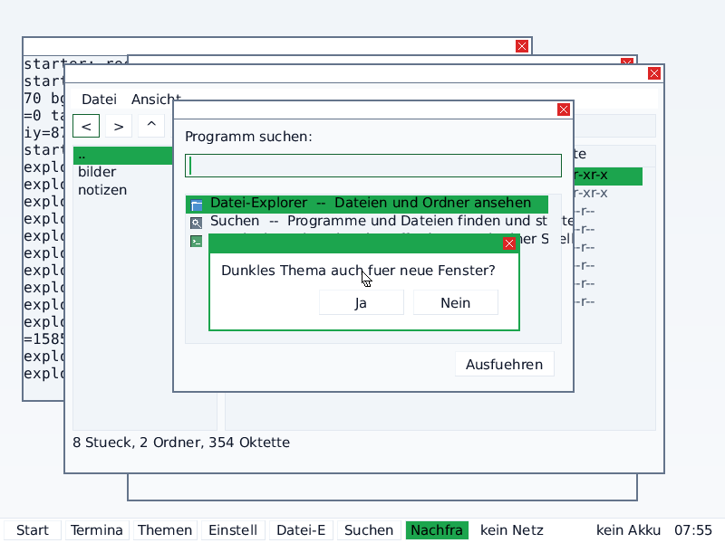
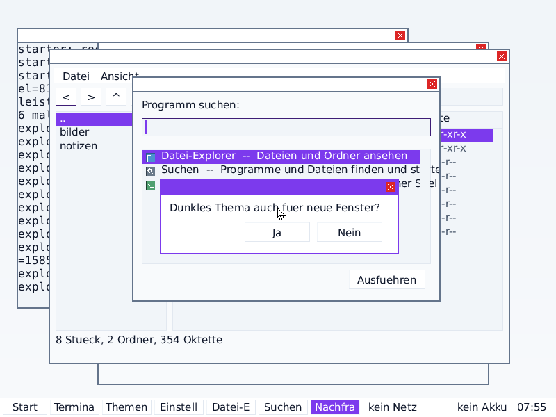
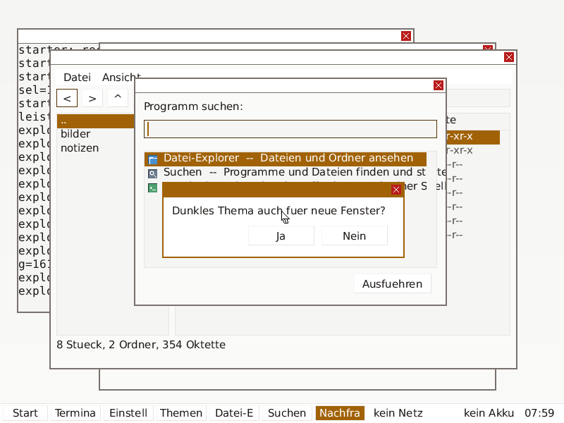
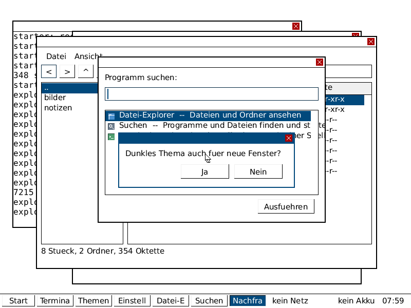
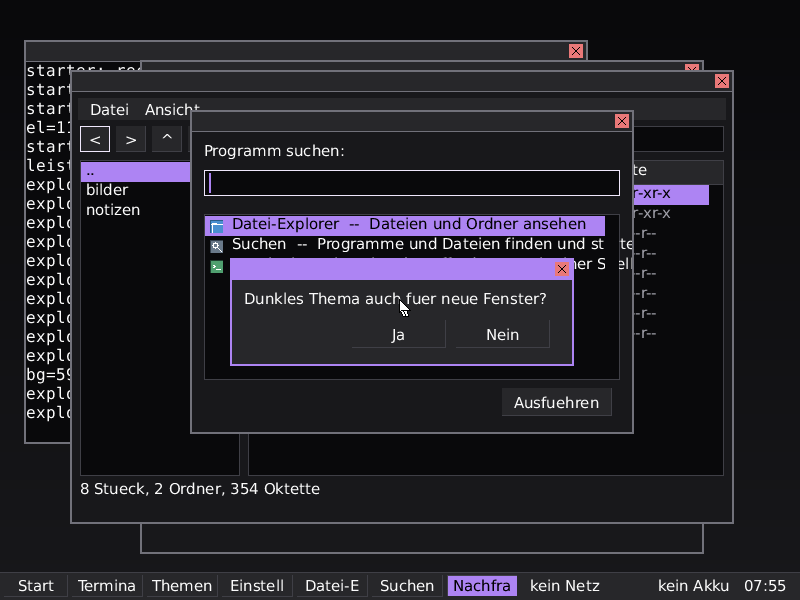

# Round THEME — tokens instead of colours

Until this round the colours of the interface were a **list**: eighteen
values with names in `/etc/theme`, and every widget picked one out of it
(`kernel/user/wlibc.fi`, round K15). That carries exactly as far as one
appearance. The moment the same interface has to exist in light **and**
in dark, a list means eighteen values times two, times every scheme,
kept in step by hand — and the first time somebody forgets one, a window
has a dark title bar on a white desktop and nobody can say which of the
five files is wrong.

This round replaces the list with the three-layer arrangement that
design systems use, and then measures whether the result actually holds.

Everything below is from a run. Where a number is missing, it says so.

---

## 1. What was there before, precisely

| | |
|---|---|
| colours | 18, flat, named `bg`, `fg`, `dim`, `panel`, `btn`, `btnhi`, … |
| where they came from | `theme_defaults()` in `kernel/user/wlibc.fi`, overridden by `/etc/theme` |
| light/dark | **none**. `grep -ri 'dark\|light\|accent'` over the tree: no hit that meant an appearance |
| accent colour | one entry in the list, `accent`, with no derived states |
| schemes shipped | 0 files. `/etc/schemas/` was read by the settings program and was empty; the one scheme on the disk was generated in `tools/k15/baum.py` and written to `/etc/theme` |
| raw colour literals in painting code | **21** (`tests/theme/rawcolour.py` against the commit this branch starts from) |

The window server was worse than the list: `kernel/wm.fi` painted the
frame, the title bar, the title text, the close button, the background
under all windows and both colours of a terminal window with **eleven
colour values written into the drawing code inside the kernel**. No
scheme could reach them. A light theme with a dark blue title bar is not
a light theme.

---

## 2. The three layers

```
      /etc/schemas/day            a file, key=value, readable with cat
              |
              v
  1  PRIMITIVE      neutral0 … neutral1000   (13 steps, from the file)
                    accent / danger / warning / success ramps
                    (9 steps each, COMPUTED from one base colour)
              |
              v
  2  SEMANTIC       23 roles: surface, surface-raised, surface-sunken,
                    surface-hover, surface-pressed, text-primary,
                    text-secondary, text-disabled, border, border-strong,
                    border-focus, accent, accent-hover, accent-pressed,
                    accent-disabled, on-accent, selection, on-selection,
                    overlay, danger, warning, success, shadow
              |
              v
  3  COMPONENT      41 tokens: window-bg, titlebar-bg, titlebar-text,
                    button-face, button-hover, button-pressed,
                    input-bg, input-border, list-bg, scroll-thumb,
                    taskbar-bg, window-frame, menu-bg, dialog-bg, …
```

**The point of the middle layer is that light and dark are two bindings
of the same names.** There is no second set of colours and no `if dark`
in any drawing routine. There are two branches in one function,
`bind_neutrals` in `kernel/user/wlibc.fi`, and the high-contrast scheme
adds a third.

The component layer is a table from component to role,
`comp_role[41]`, and there is no second way in:

| # | component token | role | value in `day`/light |
|---|---|---|---|
| 0 | `window-bg` | `surface` | #F8FAFC |
| 1 | `window-text` | `text-primary` | #0F172A |
| 2 | `text-muted` | `text-secondary` | #475569 |
| 3 | `panel-bg` | `surface-raised` | #FFFFFF |
| 4 | `button-face` | `surface-raised` | #FFFFFF |
| 5 | `button-hover` | `surface-hover` | #F1F5F9 |
| 6 | `button-pressed` | `surface-pressed` | #E2E8F0 |
| 7 | `border` | `border` | #E2E8F0 |
| 8 | `select-bg` | `selection` | #2563EB |
| 9 | `select-text` | `on-selection` | #FFFFFF |
| 10 | `focus-ring` | `border-focus` | #123175 |
| 11 | `input-bg` | `surface-sunken` | #F1F5F9 |
| 12 | `header-bg` | `surface-hover` | #F1F5F9 |
| 13 | `scroll-track` | `surface-sunken` | #F1F5F9 |
| 14 | `scroll-thumb` | `border-strong` | #64748B |
| 15 | `accent` | `accent` | #2563EB |
| 16 | `dialog-bg` | `overlay` | #FFFFFF |
| 17 | `menu-bg` | `overlay` | #FFFFFF |
| 18 | `titlebar-bg` | `accent` | #2563EB |
| 19 | `titlebar-text` | `on-accent` | #FFFFFF |
| 20 | `titlebar-off-bg` | `surface-raised` | #FFFFFF |
| 21 | `titlebar-off-text` | `text-secondary` | #475569 |
| 22 | `window-frame` | `border-strong` | #64748B |
| 23 | `taskbar-bg` | `surface-raised` | #FFFFFF |
| 24 | `taskbar-text` | `text-primary` | #0F172A |
| 25 | `taskbar-active` | `accent` | #2563EB |
| 26 | `desktop-top` | `surface-sunken` | #F1F5F9 |
| 27 | `desktop-bottom` | `surface` | #F8FAFC |
| 28 | `button-text` | `text-primary` | #0F172A |
| 29 | `button-disabled-text` | `text-disabled` | #94A3B8 |
| 30 | `input-text` | `text-primary` | #0F172A |
| 31 | `input-border` | `border-strong` | #64748B |
| 32 | `list-bg` | `surface-sunken` | #F1F5F9 |
| 33 | `menu-text` | `text-primary` | #0F172A |
| 34 | `shadow` | `shadow` | #020617 |
| 35 | `danger` | `danger` | #DC2626 |
| 36 | `warning` | `warning` | #B45309 |
| 37 | `success` | `success` | #15803D |
| 38 | `on-accent` | `on-accent` | #FFFFFF |
| 39 | `accent-hover` | `accent-hover` | #2057CE |
| 40 | `accent-pressed` | `accent-pressed` | #1B49AD |

The first eighteen numbers are the ones round K15 handed out, so no call
site in `kernel/user/wlib.fi` had to be renumbered. The **names** are
new, because the old ones named a colour (`btnhi`) and these name a part
of a control.

### Where the palette comes from

The design skill on this machine
(`/root/jarvis/plugins/ui-ux-pro-max/.claude/skills/`) ships 161
palettes and a description of exactly this three-layer architecture
(`design-system/references/token-architecture.md`). Nothing here was
invented; the schemes name their source:

| scheme | source palette | why |
|---|---|---|
| `day` | 30, *Knowledge Base/Documentation* (#475569 / #2563EB, “neutral grey + link blue”) | the only entry in the file whose subject is reading text in windows all day, which is what a desktop is |
| `paper` | 4, *E-commerce Luxury* (#1C1917 / #A16207, Stone ramp) | a warm light scheme where `day` is cool |
| `night` | 81, *Developer Tool / IDE* (#1E293B / #22C55E, “code dark + run green”) | same Slate ramp as `day`, so the two differ in the accent and in which end of the ramp the semantics bind to, and in nothing else |
| `midnight` | 126, *Photo Editor & Filters* (#7C3AED, Zinc ramp) | two dark schemes that differ only in the accent would not be two schemes |
| `contrast` | 13, *Government/Public Service* (#0F172A / #0369A1) | accent darkened to #01497C so that white on it clears 7:1 and not merely 4.5:1 |

The neutral ramps are Tailwind **Slate**, **Stone** and **Zinc** — the
ramps that palette file is largely built on. A ramp generated from
#2563EB by the mixer in `ramp_build` lands within a few units of
Tailwind `blue-100 … blue-900`; that is what the mixing percentages were
read off.

---

## 3. The scheme file format

`/etc/schemas/<name>`, `key=value`, one per line, `#` starts a comment,
English keys, readable with `cat`:

```
name=Slate Day
mode=light
contrast=normal

neutral0=ffffff
neutral50=f8fafc
…
neutral1000=000000

accent=2563eb
danger=dc2626
warning=b45309
success=15803d
```

`mode` is the mode the scheme was drawn for, **not** a restriction —
every scheme carries a full ramp and works in both. `contrast=high`
selects a third binding of the semantic layer in which the border *is*
the text colour, secondary text is primary text, and the raised and
sunken surfaces collapse onto the surface. Depth drawn as three close
greys is depth a washed-out display eats.

A line that names nothing is **counted**, not swallowed. A file with
three good keys and four bad ones reports `3` and `4`
(`tests/theme/run.sh`, section 10).

The active choice is a second file, `/etc/theme.conf`, because it is a
**setting** and a scheme is **content**:

```
scheme=day
mode=auto          # light | dark | auto
accent=            # empty = the scheme's own
light_start=07:00
dark_start=19:00
```

Five schemes are shipped: `day`, `paper` (light), `night`, `midnight`
(dark), `contrast` (accessibility).

---

## 4. Contrast: how it is computed

WCAG 2.1 wants relative luminance, and relative luminance wants
`x**2.4`. This kernel has a freestanding profile and no libm, so the
whole thing is done in 64-bit integers at a fixed scale of `1 << 24`:

```
x**2.4  ==  x**2 * (x**2)**(1/5)
```

and the fifth root is Newton's method, `r <- (4r + v/r^4)/5`. The
product of two values in [0,1] fits in 48 bits, so nothing needs a
128-bit type. The linear-branch cut of the WCAG formula
(`c <= 0.03928`) falls at `c <= 10` on the integer grid, and the second
implementation cuts in the same place — two implementations that round
differently are not two implementations of the same thing.

**How well it holds.** The kernel prints all 256 channel values; the
test compares them against `tools/theme/model.py` and against the
floating-point formula itself:

| | |
|---|---|
| values compared | 256 |
| disagreements between Osum and `model.py` | **0** |
| largest absolute error against the float formula | **4.901 × 10⁻⁷**, at c = 248 |

Contrast ratios come out as an integer times 100: `516` reads as
5.16:1.

### What the accent has to satisfy

| rule | requirement | high-contrast scheme |
|---|---|---|
| WCAG 1.4.3 — text on the accent | 4.5:1 | 7.0:1 |
| WCAG 1.4.11 — the accent as a user interface component against the surface | 3.0:1 | 4.5:1 |

If the colour the user typed fails, the generated ramp is searched —
nearest step first, in the direction the mode prefers — and the accent
**moves**. It is not silently allowed and it is not silently refused
either: `theme_accent_exact()` and `theme_accent_ok()` come back out and
the settings window prints both, together with the two measured ratios.

**A first version of this walked one step at a time and was wrong.** On
a green the readable label is *black*, so darkening the green to satisfy
the surface rule walks the label rule off a cliff, and no step of a
green ramp satisfies both at once. Hover and pressed are therefore no
longer ramp steps: they are derived from the accent in the direction
that can only *help* the label (if the label is light they go darker, if
it is dark they go lighter), so their label contrast is at least that of
the accent itself, by construction.

Likewise, the focus ring is **not** the accent. It is the step of the
accent ramp with the most contrast against the surface. Tying it to the
accent produced a **1.91:1** ring for the green scheme in light mode,
and a focus ring nobody can see is not a focus ring.

### What the numbers decided

Two tokens were changed *because of a measurement*, and the reason is in
the source at the line that sets them:

* light `text-secondary` is `neutral600` and not `neutral500`, because
  `neutral500` on `surface-sunken` measures **4.34:1** and the bar is
  4.5.
* light `border-strong` is `neutral500` and not `neutral400`, because a
  control boundary is a user interface component and `neutral400`
  measures **2.45:1** against a 3:1 bar.

---

## 5. The contrast tables

Every text-on-surface pairing the system can produce — not a selection
of the flattering ones — for all five schemes in both modes. `decor`
marks the hairline divider inside a panel, which WCAG 1.4.11 exempts as
decoration; it is measured and printed anyway, because a number that is
allowed to be low still has to be looked at.

### Summary

| scheme | name | mode | worst text pairing | worst UI pairing | pairings below the bar | accent moved by |
|---|---|---|---|---|---|---|
| `day` | Slate Day | light | 4.61:1 | 4.54:1 | 0 | 0 |
| `day` | Slate Day | dark | 5.70:1 | 3.75:1 | 0 | 0 |
| `paper` | Warm Paper | light | 4.71:1 | 4.59:1 | 0 | 0 |
| `paper` | Warm Paper | dark | 5.34:1 | 3.64:1 | 0 | 0 |
| `night` | Slate Night | light | 4.61:1 | 3.06:1 | 0 | **1 step** |
| `night` | Slate Night | dark | 5.70:1 | 3.75:1 | 0 | 0 |
| `midnight` | Zinc Midnight | light | 4.62:1 | 4.63:1 | 0 | 0 |
| `midnight` | Zinc Midnight | dark | 5.81:1 | 3.66:1 | 0 | 0 |
| `contrast` | High Contrast | light | 7.88:1 | 9.35:1 | 0 | 0 |
| `contrast` | High Contrast | dark | 9.05:1 | 9.89:1 | 0 | **1 step** |

`night` in light mode is the interesting row and it is deliberate: its
green accent fails the 3:1 rule on a light surface, so the system walks
the ramp, lands on #1CA54E, and the settings window says so. A scheme
that only ever behaves is a scheme that never tests anything.

### With a user-chosen accent

Six colours through the day scheme in light mode, measured in the
running system (`tests/theme/run.sh`, section 6):

| asked for | used | exact? | steps moved | text on accent | accent on surface |
|---|---|---|---|---|---|
| #2563EB | #2563EB | yes | 0 | 5.16:1 | 4.93:1 |
| #7C3AED | #7C3AED | yes | 0 | 5.69:1 | 5.44:1 |
| #A16207 | #A16207 | yes | 0 | 4.92:1 | 4.70:1 |
| #FFFF00 | **#7F7F00** | no | 3 | 4.93:1 | 4.06:1 |
| #22C55E | **#1CA54E** | no | 1 | 6.54:1 | 3.06:1 |
| #FFFFFF | **#7F7F7F** | no | 3 | 5.24:1 | 3.82:1 |

The three that moved are the three the settings window reports as
moved. In every case the result clears both bars.

### The full tables

Osum's own numbers and `tools/theme/model.py`'s numbers agree on all
**21 pairings × 5 schemes × 2 modes = 210 ratios**, exactly
(`tests/theme/run.sh`, section 5).

#### `day` -- Slate Day, light

| foreground | background | colours | measured | required | |
|---|---|---|---|---|---|
| `text-primary` | `surface` | #0F172A on #F8FAFC | **17.06:1** | 4.5:1 | ok |
| `text-primary` | `surface-raised` | #0F172A on #FFFFFF | **17.85:1** | 4.5:1 | ok |
| `text-primary` | `surface-sunken` | #0F172A on #F1F5F9 | **16.29:1** | 4.5:1 | ok |
| `text-primary` | `surface-hover` | #0F172A on #F1F5F9 | **16.29:1** | 4.5:1 | ok |
| `text-primary` | `surface-pressed` | #0F172A on #E2E8F0 | **14.48:1** | 4.5:1 | ok |
| `text-primary` | `overlay` | #0F172A on #FFFFFF | **17.85:1** | 4.5:1 | ok |
| `text-secondary` | `surface` | #475569 on #F8FAFC | **7.24:1** | 4.5:1 | ok |
| `text-secondary` | `surface-raised` | #475569 on #FFFFFF | **7.57:1** | 4.5:1 | ok |
| `text-secondary` | `surface-sunken` | #475569 on #F1F5F9 | **6.91:1** | 4.5:1 | ok |
| `text-secondary` | `surface-hover` | #475569 on #F1F5F9 | **6.91:1** | 4.5:1 | ok |
| `on-accent` | `accent` | #FFFFFF on #2563EB | **5.16:1** | 4.5:1 | ok |
| `on-accent` | `accent-hover` | #FFFFFF on #2057CE | **6.33:1** | 4.5:1 | ok |
| `on-accent` | `accent-pressed` | #FFFFFF on #1B49AD | **8.06:1** | 4.5:1 | ok |
| `on-selection` | `selection` | #FFFFFF on #2563EB | **5.16:1** | 4.5:1 | ok |
| `danger` | `surface` | #DC2626 on #F8FAFC | **4.61:1** | 4.5:1 | ok |
| `warning` | `surface` | #B45309 on #F8FAFC | **4.79:1** | 4.5:1 | ok |
| `success` | `surface` | #15803D on #F8FAFC | **4.79:1** | 4.5:1 | ok |
| `accent` | `surface` | #2563EB on #F8FAFC | **4.93:1** | 3.0:1 | ok |
| `border-focus` | `surface` | #123175 on #F8FAFC | **11.65:1** | 3.0:1 | ok |
| `border-strong` | `surface` | #64748B on #F8FAFC | **4.54:1** | 3.0:1 | ok |
| `border` | `surface` | #E2E8F0 on #F8FAFC | **1.17:1** | -- | ok |

#### `day` -- Slate Day, dark

| foreground | background | colours | measured | required | |
|---|---|---|---|---|---|
| `text-primary` | `surface` | #F8FAFC on #0F172A | **17.06:1** | 4.5:1 | ok |
| `text-primary` | `surface-raised` | #F8FAFC on #1E293B | **13.98:1** | 4.5:1 | ok |
| `text-primary` | `surface-sunken` | #F8FAFC on #020617 | **19.28:1** | 4.5:1 | ok |
| `text-primary` | `surface-hover` | #F8FAFC on #1E293B | **13.98:1** | 4.5:1 | ok |
| `text-primary` | `surface-pressed` | #F8FAFC on #334155 | **9.89:1** | 4.5:1 | ok |
| `text-primary` | `overlay` | #F8FAFC on #1E293B | **13.98:1** | 4.5:1 | ok |
| `text-secondary` | `surface` | #94A3B8 on #0F172A | **6.96:1** | 4.5:1 | ok |
| `text-secondary` | `surface-raised` | #94A3B8 on #1E293B | **5.70:1** | 4.5:1 | ok |
| `text-secondary` | `surface-sunken` | #94A3B8 on #020617 | **7.86:1** | 4.5:1 | ok |
| `text-secondary` | `surface-hover` | #94A3B8 on #1E293B | **5.70:1** | 4.5:1 | ok |
| `on-accent` | `accent` | #000000 on #779EF2 | **7.95:1** | 4.5:1 | ok |
| `on-accent` | `accent-hover` | #000000 on #87A9F3 | **8.99:1** | 4.5:1 | ok |
| `on-accent` | `accent-pressed` | #000000 on #9AB7F5 | **10.46:1** | 4.5:1 | ok |
| `on-selection` | `selection` | #000000 on #779EF2 | **7.95:1** | 4.5:1 | ok |
| `danger` | `surface` | #E97878 on #0F172A | **6.31:1** | 4.5:1 | ok |
| `warning` | `surface` | #D09466 on #0F172A | **6.89:1** | 4.5:1 | ok |
| `success` | `surface` | #6DB086 on #0F172A | **6.97:1** | 4.5:1 | ok |
| `accent` | `surface` | #779EF2 on #0F172A | **6.76:1** | 3.0:1 | ok |
| `border-focus` | `surface` | #E4ECFC on #0F172A | **15.04:1** | 3.0:1 | ok |
| `border-strong` | `surface` | #64748B on #0F172A | **3.75:1** | 3.0:1 | ok |
| `border` | `surface` | #334155 on #0F172A | **1.72:1** | -- | ok |

#### `paper` -- Warm Paper, light

| foreground | background | colours | measured | required | |
|---|---|---|---|---|---|
| `text-primary` | `surface` | #1C1917 on #FAFAF9 | **16.74:1** | 4.5:1 | ok |
| `text-primary` | `surface-raised` | #1C1917 on #FFFFFF | **17.48:1** | 4.5:1 | ok |
| `text-primary` | `surface-sunken` | #1C1917 on #F5F5F4 | **16.03:1** | 4.5:1 | ok |
| `text-primary` | `surface-hover` | #1C1917 on #F5F5F4 | **16.03:1** | 4.5:1 | ok |
| `text-primary` | `surface-pressed` | #1C1917 on #E7E5E4 | **13.92:1** | 4.5:1 | ok |
| `text-primary` | `overlay` | #1C1917 on #FFFFFF | **17.48:1** | 4.5:1 | ok |
| `text-secondary` | `surface` | #57534E on #FAFAF9 | **7.30:1** | 4.5:1 | ok |
| `text-secondary` | `surface-raised` | #57534E on #FFFFFF | **7.62:1** | 4.5:1 | ok |
| `text-secondary` | `surface-sunken` | #57534E on #F5F5F4 | **6.99:1** | 4.5:1 | ok |
| `text-secondary` | `surface-hover` | #57534E on #F5F5F4 | **6.99:1** | 4.5:1 | ok |
| `on-accent` | `accent` | #FFFFFF on #A16207 | **4.92:1** | 4.5:1 | ok |
| `on-accent` | `accent-hover` | #FFFFFF on #8D5606 | **6.05:1** | 4.5:1 | ok |
| `on-accent` | `accent-pressed` | #FFFFFF on #774805 | **7.73:1** | 4.5:1 | ok |
| `on-selection` | `selection` | #FFFFFF on #A16207 | **4.92:1** | 4.5:1 | ok |
| `danger` | `surface` | #B91C1C on #FAFAF9 | **6.19:1** | 4.5:1 | ok |
| `warning` | `surface` | #A16207 on #FAFAF9 | **4.71:1** | 4.5:1 | ok |
| `success` | `surface` | #15803D on #FAFAF9 | **4.80:1** | 4.5:1 | ok |
| `accent` | `surface` | #A16207 on #FAFAF9 | **4.71:1** | 3.0:1 | ok |
| `border-focus` | `surface` | #503103 on #FAFAF9 | **11.28:1** | 3.0:1 | ok |
| `border-strong` | `surface` | #78716C on #FAFAF9 | **4.59:1** | 3.0:1 | ok |
| `border` | `surface` | #E7E5E4 on #FAFAF9 | **1.20:1** | -- | ok |

#### `paper` -- Warm Paper, dark

| foreground | background | colours | measured | required | |
|---|---|---|---|---|---|
| `text-primary` | `surface` | #FAFAF9 on #1C1917 | **16.74:1** | 4.5:1 | ok |
| `text-primary` | `surface-raised` | #FAFAF9 on #292524 | **14.52:1** | 4.5:1 | ok |
| `text-primary` | `surface-sunken` | #FAFAF9 on #0C0A09 | **18.91:1** | 4.5:1 | ok |
| `text-primary` | `surface-hover` | #FAFAF9 on #292524 | **14.52:1** | 4.5:1 | ok |
| `text-primary` | `surface-pressed` | #FAFAF9 on #44403C | **9.83:1** | 4.5:1 | ok |
| `text-primary` | `overlay` | #FAFAF9 on #292524 | **14.52:1** | 4.5:1 | ok |
| `text-secondary` | `surface` | #A8A29E on #1C1917 | **6.93:1** | 4.5:1 | ok |
| `text-secondary` | `surface-raised` | #A8A29E on #292524 | **6.01:1** | 4.5:1 | ok |
| `text-secondary` | `surface-sunken` | #A8A29E on #0C0A09 | **7.83:1** | 4.5:1 | ok |
| `text-secondary` | `surface-hover` | #A8A29E on #292524 | **6.01:1** | 4.5:1 | ok |
| `on-accent` | `accent` | #000000 on #C49D65 | **8.35:1** | 4.5:1 | ok |
| `on-accent` | `accent-hover` | #000000 on #CBA877 | **9.40:1** | 4.5:1 | ok |
| `on-accent` | `accent-pressed` | #000000 on #D3B68D | **10.84:1** | 4.5:1 | ok |
| `on-selection` | `selection` | #000000 on #C49D65 | **8.35:1** | 4.5:1 | ok |
| `danger` | `surface` | #D37272 on #1C1917 | **5.34:1** | 4.5:1 | ok |
| `warning` | `surface` | #C49D65 on #1C1917 | **6.96:1** | 4.5:1 | ok |
| `success` | `surface` | #6DB086 on #1C1917 | **6.83:1** | 4.5:1 | ok |
| `accent` | `surface` | #C49D65 on #1C1917 | **6.96:1** | 3.0:1 | ok |
| `border-focus` | `surface` | #F3ECE1 on #1C1917 | **14.90:1** | 3.0:1 | ok |
| `border-strong` | `surface` | #78716C on #1C1917 | **3.64:1** | 3.0:1 | ok |
| `border` | `surface` | #44403C on #1C1917 | **1.70:1** | -- | ok |

#### `night` -- Slate Night, light

| foreground | background | colours | measured | required | |
|---|---|---|---|---|---|
| `text-primary` | `surface` | #0F172A on #F8FAFC | **17.06:1** | 4.5:1 | ok |
| `text-primary` | `surface-raised` | #0F172A on #FFFFFF | **17.85:1** | 4.5:1 | ok |
| `text-primary` | `surface-sunken` | #0F172A on #F1F5F9 | **16.29:1** | 4.5:1 | ok |
| `text-primary` | `surface-hover` | #0F172A on #F1F5F9 | **16.29:1** | 4.5:1 | ok |
| `text-primary` | `surface-pressed` | #0F172A on #E2E8F0 | **14.48:1** | 4.5:1 | ok |
| `text-primary` | `overlay` | #0F172A on #FFFFFF | **17.85:1** | 4.5:1 | ok |
| `text-secondary` | `surface` | #475569 on #F8FAFC | **7.24:1** | 4.5:1 | ok |
| `text-secondary` | `surface-raised` | #475569 on #FFFFFF | **7.57:1** | 4.5:1 | ok |
| `text-secondary` | `surface-sunken` | #475569 on #F1F5F9 | **6.91:1** | 4.5:1 | ok |
| `text-secondary` | `surface-hover` | #475569 on #F1F5F9 | **6.91:1** | 4.5:1 | ok |
| `on-accent` | `accent` | #000000 on #1CA54E | **6.54:1** | 4.5:1 | ok |
| `on-accent` | `accent-hover` | #000000 on #37AF63 | **7.47:1** | 4.5:1 | ok |
| `on-accent` | `accent-pressed` | #000000 on #57BC7C | **8.88:1** | 4.5:1 | ok |
| `on-selection` | `selection` | #000000 on #1CA54E | **6.54:1** | 4.5:1 | ok |
| `danger` | `surface` | #DC2626 on #F8FAFC | **4.61:1** | 4.5:1 | ok |
| `warning` | `surface` | #B45309 on #F8FAFC | **4.79:1** | 4.5:1 | ok |
| `success` | `surface` | #15803D on #F8FAFC | **4.79:1** | 4.5:1 | ok |
| `accent` | `surface` | #1CA54E on #F8FAFC | **3.06:1** | 3.0:1 | ok |
| `border-focus` | `surface` | #11622F on #F8FAFC | **7.13:1** | 3.0:1 | ok |
| `border-strong` | `surface` | #64748B on #F8FAFC | **4.54:1** | 3.0:1 | ok |
| `border` | `surface` | #E2E8F0 on #F8FAFC | **1.17:1** | -- | ok |

#### `night` -- Slate Night, dark

| foreground | background | colours | measured | required | |
|---|---|---|---|---|---|
| `text-primary` | `surface` | #F8FAFC on #0F172A | **17.06:1** | 4.5:1 | ok |
| `text-primary` | `surface-raised` | #F8FAFC on #1E293B | **13.98:1** | 4.5:1 | ok |
| `text-primary` | `surface-sunken` | #F8FAFC on #020617 | **19.28:1** | 4.5:1 | ok |
| `text-primary` | `surface-hover` | #F8FAFC on #1E293B | **13.98:1** | 4.5:1 | ok |
| `text-primary` | `surface-pressed` | #F8FAFC on #334155 | **9.89:1** | 4.5:1 | ok |
| `text-primary` | `overlay` | #F8FAFC on #1E293B | **13.98:1** | 4.5:1 | ok |
| `text-secondary` | `surface` | #94A3B8 on #0F172A | **6.96:1** | 4.5:1 | ok |
| `text-secondary` | `surface-raised` | #94A3B8 on #1E293B | **5.70:1** | 4.5:1 | ok |
| `text-secondary` | `surface-sunken` | #94A3B8 on #020617 | **7.86:1** | 4.5:1 | ok |
| `text-secondary` | `surface-hover` | #94A3B8 on #1E293B | **5.70:1** | 4.5:1 | ok |
| `on-accent` | `accent` | #000000 on #75DB9B | **12.36:1** | 4.5:1 | ok |
| `on-accent` | `accent-hover` | #000000 on #85DFA7 | **13.11:1** | 4.5:1 | ok |
| `on-accent` | `accent-pressed` | #000000 on #98E4B5 | **14.09:1** | 4.5:1 | ok |
| `on-selection` | `selection` | #000000 on #75DB9B | **12.36:1** | 4.5:1 | ok |
| `danger` | `surface` | #E97878 on #0F172A | **6.31:1** | 4.5:1 | ok |
| `warning` | `surface` | #D09466 on #0F172A | **6.89:1** | 4.5:1 | ok |
| `success` | `surface` | #6DB086 on #0F172A | **6.97:1** | 4.5:1 | ok |
| `accent` | `surface` | #75DB9B on #0F172A | **10.50:1** | 3.0:1 | ok |
| `border-focus` | `surface` | #E4F8EB on #0F172A | **16.08:1** | 3.0:1 | ok |
| `border-strong` | `surface` | #64748B on #0F172A | **3.75:1** | 3.0:1 | ok |
| `border` | `surface` | #334155 on #0F172A | **1.72:1** | -- | ok |

#### `midnight` -- Zinc Midnight, light

| foreground | background | colours | measured | required | |
|---|---|---|---|---|---|
| `text-primary` | `surface` | #18181B on #FAFAFA | **16.97:1** | 4.5:1 | ok |
| `text-primary` | `surface-raised` | #18181B on #FFFFFF | **17.71:1** | 4.5:1 | ok |
| `text-primary` | `surface-sunken` | #18181B on #F4F4F5 | **16.11:1** | 4.5:1 | ok |
| `text-primary` | `surface-hover` | #18181B on #F4F4F5 | **16.11:1** | 4.5:1 | ok |
| `text-primary` | `surface-pressed` | #18181B on #E4E4E7 | **13.96:1** | 4.5:1 | ok |
| `text-primary` | `overlay` | #18181B on #FFFFFF | **17.71:1** | 4.5:1 | ok |
| `text-secondary` | `surface` | #52525B on #FAFAFA | **7.40:1** | 4.5:1 | ok |
| `text-secondary` | `surface-raised` | #52525B on #FFFFFF | **7.72:1** | 4.5:1 | ok |
| `text-secondary` | `surface-sunken` | #52525B on #F4F4F5 | **7.03:1** | 4.5:1 | ok |
| `text-secondary` | `surface-hover` | #52525B on #F4F4F5 | **7.03:1** | 4.5:1 | ok |
| `on-accent` | `accent` | #FFFFFF on #7C3AED | **5.69:1** | 4.5:1 | ok |
| `on-accent` | `accent-hover` | #FFFFFF on #6D33D0 | **6.92:1** | 4.5:1 | ok |
| `on-accent` | `accent-pressed` | #FFFFFF on #5B2AAF | **8.76:1** | 4.5:1 | ok |
| `on-selection` | `selection` | #FFFFFF on #7C3AED | **5.69:1** | 4.5:1 | ok |
| `danger` | `surface` | #DC2626 on #FAFAFA | **4.62:1** | 4.5:1 | ok |
| `warning` | `surface` | #B45309 on #FAFAFA | **4.81:1** | 4.5:1 | ok |
| `success` | `surface` | #15803D on #FAFAFA | **4.80:1** | 4.5:1 | ok |
| `accent` | `surface` | #7C3AED on #FAFAFA | **5.45:1** | 3.0:1 | ok |
| `border-focus` | `surface` | #3E1D76 on #FAFAFA | **12.25:1** | 3.0:1 | ok |
| `border-strong` | `surface` | #71717A on #FAFAFA | **4.63:1** | 3.0:1 | ok |
| `border` | `surface` | #E4E4E7 on #FAFAFA | **1.21:1** | -- | ok |

#### `midnight` -- Zinc Midnight, dark

| foreground | background | colours | measured | required | |
|---|---|---|---|---|---|
| `text-primary` | `surface` | #FAFAFA on #18181B | **16.97:1** | 4.5:1 | ok |
| `text-primary` | `surface-raised` | #FAFAFA on #27272A | **14.27:1** | 4.5:1 | ok |
| `text-primary` | `surface-sunken` | #FAFAFA on #09090B | **19.06:1** | 4.5:1 | ok |
| `text-primary` | `surface-hover` | #FAFAFA on #27272A | **14.27:1** | 4.5:1 | ok |
| `text-primary` | `surface-pressed` | #FAFAFA on #3F3F46 | **10.00:1** | 4.5:1 | ok |
| `text-primary` | `overlay` | #FAFAFA on #27272A | **14.27:1** | 4.5:1 | ok |
| `text-secondary` | `surface` | #A1A1AA on #18181B | **6.91:1** | 4.5:1 | ok |
| `text-secondary` | `surface-raised` | #A1A1AA on #27272A | **5.81:1** | 4.5:1 | ok |
| `text-secondary` | `surface-sunken` | #A1A1AA on #09090B | **7.76:1** | 4.5:1 | ok |
| `text-secondary` | `surface-hover` | #A1A1AA on #27272A | **5.81:1** | 4.5:1 | ok |
| `on-accent` | `accent` | #000000 on #AD84F3 | **7.37:1** | 4.5:1 | ok |
| `on-accent` | `accent-hover` | #000000 on #B692F4 | **8.40:1** | 4.5:1 | ok |
| `on-accent` | `accent-pressed` | #000000 on #C2A3F6 | **9.86:1** | 4.5:1 | ok |
| `on-selection` | `selection` | #000000 on #AD84F3 | **7.37:1** | 4.5:1 | ok |
| `danger` | `surface` | #E97878 on #18181B | **6.26:1** | 4.5:1 | ok |
| `warning` | `surface` | #D09466 on #18181B | **6.84:1** | 4.5:1 | ok |
| `success` | `surface` | #6DB086 on #18181B | **6.92:1** | 4.5:1 | ok |
| `accent` | `surface` | #AD84F3 on #18181B | **6.21:1** | 3.0:1 | ok |
| `border-focus` | `surface` | #EFE7FC on #18181B | **14.76:1** | 3.0:1 | ok |
| `border-strong` | `surface` | #71717A on #18181B | **3.66:1** | 3.0:1 | ok |
| `border` | `surface` | #3F3F46 on #18181B | **1.69:1** | -- | ok |

#### `contrast` -- High Contrast, light

| foreground | background | colours | measured | required | |
|---|---|---|---|---|---|
| `text-primary` | `surface` | #000000 on #FFFFFF | **21.00:1** | 7.0:1 | ok |
| `text-primary` | `surface-raised` | #000000 on #FFFFFF | **21.00:1** | 7.0:1 | ok |
| `text-primary` | `surface-sunken` | #000000 on #FFFFFF | **21.00:1** | 7.0:1 | ok |
| `text-primary` | `surface-hover` | #000000 on #F0F0F0 | **18.42:1** | 7.0:1 | ok |
| `text-primary` | `surface-pressed` | #000000 on #D0D0D0 | **13.61:1** | 7.0:1 | ok |
| `text-primary` | `overlay` | #000000 on #FFFFFF | **21.00:1** | 7.0:1 | ok |
| `text-secondary` | `surface` | #000000 on #FFFFFF | **21.00:1** | 7.0:1 | ok |
| `text-secondary` | `surface-raised` | #000000 on #FFFFFF | **21.00:1** | 7.0:1 | ok |
| `text-secondary` | `surface-sunken` | #000000 on #FFFFFF | **21.00:1** | 7.0:1 | ok |
| `text-secondary` | `surface-hover` | #000000 on #F0F0F0 | **18.42:1** | 7.0:1 | ok |
| `on-accent` | `accent` | #FFFFFF on #01497C | **9.35:1** | 7.0:1 | ok |
| `on-accent` | `accent-hover` | #FFFFFF on #00406D | **10.74:1** | 7.0:1 | ok |
| `on-accent` | `accent-pressed` | #FFFFFF on #00365B | **12.50:1** | 7.0:1 | ok |
| `on-selection` | `selection` | #FFFFFF on #01497C | **9.35:1** | 7.0:1 | ok |
| `danger` | `surface` | #A80000 on #FFFFFF | **7.88:1** | 7.0:1 | ok |
| `warning` | `surface` | #6B3B00 on #FFFFFF | **9.33:1** | 7.0:1 | ok |
| `success` | `surface` | #005C2E on #FFFFFF | **8.17:1** | 7.0:1 | ok |
| `accent` | `surface` | #01497C on #FFFFFF | **9.35:1** | 4.5:1 | ok |
| `border-focus` | `surface` | #00243E on #FFFFFF | **15.88:1** | 4.5:1 | ok |
| `border-strong` | `surface` | #000000 on #FFFFFF | **21.00:1** | 4.5:1 | ok |
| `border` | `surface` | #000000 on #FFFFFF | **21.00:1** | -- | ok |

#### `contrast` -- High Contrast, dark

| foreground | background | colours | measured | required | |
|---|---|---|---|---|---|
| `text-primary` | `surface` | #FFFFFF on #000000 | **21.00:1** | 7.0:1 | ok |
| `text-primary` | `surface-raised` | #FFFFFF on #000000 | **21.00:1** | 7.0:1 | ok |
| `text-primary` | `surface-sunken` | #FFFFFF on #000000 | **21.00:1** | 7.0:1 | ok |
| `text-primary` | `surface-hover` | #FFFFFF on #141414 | **18.42:1** | 7.0:1 | ok |
| `text-primary` | `surface-pressed` | #FFFFFF on #262626 | **15.13:1** | 7.0:1 | ok |
| `text-primary` | `overlay` | #FFFFFF on #000000 | **21.00:1** | 7.0:1 | ok |
| `text-secondary` | `surface` | #FFFFFF on #000000 | **21.00:1** | 7.0:1 | ok |
| `text-secondary` | `surface-raised` | #FFFFFF on #000000 | **21.00:1** | 7.0:1 | ok |
| `text-secondary` | `surface-sunken` | #FFFFFF on #000000 | **21.00:1** | 7.0:1 | ok |
| `text-secondary` | `surface-hover` | #FFFFFF on #141414 | **18.42:1** | 7.0:1 | ok |
| `on-accent` | `accent` | #000000 on #99B6CA | **9.89:1** | 7.0:1 | ok |
| `on-accent` | `accent-hover` | #000000 on #A5BED0 | **10.87:1** | 7.0:1 | ok |
| `on-accent` | `accent-pressed` | #000000 on #B3C8D7 | **12.15:1** | 7.0:1 | ok |
| `on-selection` | `selection` | #000000 on #99B6CA | **9.89:1** | 7.0:1 | ok |
| `danger` | `surface` | #DC9999 on #000000 | **9.05:1** | 7.0:1 | ok |
| `warning` | `surface` | #C3B099 on #000000 | **9.99:1** | 7.0:1 | ok |
| `success` | `surface` | #99BDAB on #000000 | **10.22:1** | 7.0:1 | ok |
| `accent` | `surface` | #99B6CA on #000000 | **9.89:1** | 4.5:1 | ok |
| `border-focus` | `surface` | #E0E9EF on #000000 | **17.07:1** | 4.5:1 | ok |
| `border-strong` | `surface` | #FFFFFF on #000000 | **21.00:1** | 4.5:1 | ok |
| `border` | `surface` | #FFFFFF on #000000 | **21.00:1** | -- | ok |

---

## 6. Switching at runtime

### The window side: no window is ever half light and half dark

The resolved component table exists **twice** (`tok`, two banks). A
rebuild fills the bank that is not in use and then flips one word,
`live`. A window latches the live bank at the top of its paint
(`theme_frame_begin`) and reads that bank until the paint is finished;
`theme_frame_end` afterwards says whether the theme moved while it ran,
and if it did the window owes the screen exactly **one** more pass — one,
not a loop, because the next paint latches the new bank.

Measured directly (`tests/theme/run.sh`, section 7): latch the bank,
read `window-bg`, switch to dark **in the middle**, read it again.

| | |
|---|---|
| before | `#F8FAFC` |
| inside the same paint, after switching | `#F8FAFC` — unchanged |
| the live bank at the same moment | `#0F172A` — the counter-check: it really did change |
| paint reports itself stale afterwards | yes |
| the next paint | `#0F172A`, not stale |

This was broken once, and the test said so in one line: `L_INNER` came
back dark inside a light frame, because `publish()` was moving
`paint_base`. It now only moves it when no paint is open.

### What it costs

`tests/theme/run.sh`, section 8. Single process, no desktop running:

| step | time |
|---|---|
| resolve (build 4 ramps, bind 23 roles, run the contrast search, publish 41 tokens) | **280 µs** |
| poll at rest (read `/etc/theme.conf`, compare the octets) | **5.4 ms** |
| full reload (three files plus resolve) | **31.9 ms** |

Almost all of the last two is the disk: this is OFS over an IDE
controller in PIO, and a file read is by far the most expensive line in
the whole business. That is why the poll compares the octets of *one*
small file and only reloads when they differ, and why `theme_poll`
answers a change of mode under `mode=auto` from the clock alone, with
two system calls and no disk at all.

With the desktop, the taskbar, the file manager, the launcher and a
widget window all running (`themegui`, 20 switches through the file):

| | fastest run | note |
|---|---|---|
| detect (read, compare, reload, resolve, publish) | **37.6 ms** | five processes on one virtual CPU |
| repaint the window | **87.1 ms** | for **165 600** of **480 000** screen pixels (34.5 %) |
| counter-check: an ordinary full repaint with no theme change at all | **94.6 ms** | |

**A theme switch costs one full repaint and nothing more.** That is the
honest reading of those two numbers: 87 ms against 94 ms is the same
figure twice. The mean over twenty runs scatters by more than a factor
of two, and the reason is scheduling, not the theme — the desktop and
the taskbar are repainting their own areas at the same time on the same
core.

The area figure is per window. On a screen-wide switch every window
repaints its own area, so the total is the screen.

### What this does not buy, and it is not hidden

Each program picks the change up **on its own poll**, and the poll runs
every 25 ticks = **250 ms** (`THEME_POLL_TICKS` in `kernel/user/wlib.fi`;
the taskbar and the desktop poll at the same rate). So:

* **every window is atomic** — no window is ever half light and half
  dark, proven above;
* **the screen is not** — for up to 250 ms plus one repaint the taskbar
  can already be dark while a window is still light.

That is a real defect and the round did not fix it. The right fix is a
notification from the window server instead of polling, and building one
would have meant giving the server a notion of “theme”, which is exactly
what this round is trying to take away from it. A generic property-change
channel would do it and does not exist yet.

The poll is also not free: 5.4 ms every 250 ms is about **2.2 % of one
core**, spent watching a file that almost never changes. On real
hardware with a block cache that number would collapse; on this
machine it does not.

One more thing the poll does **not** notice: an edit *inside* a scheme
file under `/etc/schemas/` while that scheme is selected. Touch
`/etc/theme.conf` or restart the program. A scheme is content, not a
setting.

### Automatic by time of day

`mode=auto` uses the clock from round K9 (`sysinfo`) plus the offset in
`/etc/time.conf`, wrapping over midnight, so `19:00 → 07:00` — the
normal case, and exactly the one a naive `a <= t && t < b` gets wrong.
Without `/etc/time.conf` it is UTC and nothing pretends otherwise.

`/etc/time.conf` was read with a 64-octet buffer at first. The file
opens with two lines of comment, so the whole read *was* comment,
`offset=` was never reached, and the machine ran on UTC while the file
said `offset=120`. It goes through the same key=value parser as
everything else now. The old German name `/etc/zeit.conf` is still read
as a fallback; a machine that loses its timezone on an upgrade is not an
upgrade.

---

## 7. The window server does not choose colours any more

Frame and title bar are painted by the server, because the server
composites the screen. Before this round that meant the only surface of
the interface that knew its own colour sat **in the kernel**.

The fix is not to let the kernel read the theme — then the kernel would
have an opinion about what a window looks like. The server now holds
**eleven numbers** and a new call puts them there:

```
WM_DECO (2112)  (slot, 0xRRGGBB) -> 0
```

| slot | what | component token |
|---|---|---|
| 0 | frame, unfocused | `window-frame` |
| 1 | title bar, unfocused | `titlebar-off-bg` |
| 2 | title text, unfocused | `titlebar-off-text` |
| 3 | frame, focused | `accent` |
| 4 | title bar, focused | `titlebar-bg` |
| 5 | title text, focused | `titlebar-text` |
| 6 | close button | `danger` |
| 7 | close cross | `theme_on(danger)` — computed, not chosen |
| 8 | the ground under all windows | `desktop-bottom` |
| 9 | terminal window, text | `window-text` |
| 10 | terminal window, background | `input-bg` |

Who may call it: whoever **is** a taskbar (owns a window on layer
`L_TOP`) — the same right as `WM_ACT`. If any application could, any
application could recolour any other application's title bar. The
taskbar pushes all eleven right after it creates its window and again
after every theme change; the run reports `leiste: deko n=11`.

Setting a value does **not** composite. The first version did, and
because a taskbar sets eleven colours in a row that was eleven
full-screen composites inside system calls — the machine did not finish
booting. It marks the screen dirty; the server's own loop composites
sixty times a second anyway.

**The mouse pointer is deliberately left out.** It lies over the
application's own pixels, and what is there is not decided by any theme.
White with a black outline is visible on anything; a pointer coloured by
the theme is a pointer you lose on the wrong picture.

---

## 8. No colour in painting code

`tests/theme/rawcolour.py` scans the ten files that decide what the
interface looks like — the drawing core, the widget library, the six
programs with a window, and `kernel/wm.fi` — for hexadecimal colour
literals *and* for `fb.rgb(state, 0x10, 0x14, 0x1A)`, three channel
literals in a row.

| | |
|---|---|
| files scanned | 10 |
| token lookups in them | 123 |
| **raw colour values — before this round** | **21** |
| **raw colour values — now** | **0** |

The counter-check runs the same scanner against the commit this branch
starts from; if it found nothing there, it would be proving nothing
here.

The permitted places are two, both listed **by name** in the scanner:
`fn primitives_builtin` in `wlibc.fi` (the ramp a machine with an empty
`/etc` falls back on) and `fn deco_fallback` in `wm.fi` (what the server
draws with until a taskbar tells it otherwise — a machine whose taskbar
has not started yet may not be black on black). Plus eight named
constants that are shaped like a colour and are not one: a field mask,
two markers, the two ends the ramp generator mixes towards, a size
bound, and the two probe values of the server's self test.

The three-channel pattern was added **after** the first version of the
scanner reported zero and the screenshot still showed a dark terminal
window on a white desktop. Four colours were hiding in that shape.

---

## 9. The pictures

Seven disk images that differ in three lines of `/etc/theme.conf`, the
same screen each time — desktop, taskbar, file manager, settings,
launcher, a widget window and a dialog. The colours are counted, not
looked at (`tests/theme/pixel.py`):

| picture | scheme | mode | accent asked for | three most frequent colours |
|---|---|---|---|---|
|  | `day` | light | — | `#F1F5F9` 29 %, `#F8FAFC` 26 %, `#FFFFFF` 19 % |
|  | `day` | dark | — | `#020617` 30 %, `#0F172A` 22 %, `#1E293B` 20 % |
|  | `day` | light | `#22C55E` | `#F1F5F9` 34 %, `#F8FAFC` 22 %, `#FFFFFF` 19 % |
|  | `day` | light | `#7C3AED` | `#F1F5F9` 34 %, `#F8FAFC` 22 %, `#FFFFFF` 19 % |
|  | `paper` | light | `#A16207` | `#F5F5F4` 34 %, `#FAFAF9` 22 %, `#FFFFFF` 19 % |
|  | `contrast` | light | — | `#FFFFFF` 88 %, `#000000` 4 %, `#01497C` 4 % |
|  | `midnight` | dark | — | `#09090B` 31 %, `#18181B` 22 %, `#27272A` 20 % |

The promise behind the pictures is not “it looks different”. It is
**the colours on the screen are the resolved tokens**, and that is what
is checked: the `surface` token of that scheme in that mode has to be
among the three most frequent colours, and the resolved `accent` token
has to occur at all. For the green picture the expected accent is
**#1CA54E and not #22C55E** — the value the contrast check moved it to.
It is in the picture.

---

## 10. What broke while building this

Six faults, all found by the run and not by reading:

1. **`theme_reload` read the file it had just replaced.** A cache added
   to make the poll cheap was also used by the full reload, so a program
   that writes `/etc/theme.conf` and reloads — the settings window and
   the test program both do — resolved the *previous* contents. Five of
   ten scheme runs came back with the colours of the other mode, always
   exactly one step behind.
2. **The latch did not latch.** `publish()` moved `paint_base`, so a
   window that started painting light finished dark. One line in the
   test found it.
3. **`neutral<step>` keys were all rejected.** An inverted prefix test:
   20 keys in the scheme file, 13 counted as unreadable, and the ramp
   silently stayed at the built-in one.
4. **`/etc/time.conf` was never read.** 64-octet buffer, 130 octets of
   comment before the key.
5. **Eleven colours in the window server were invisible to the
   scanner**, because they are written as three channel arguments and
   not as one literal. The screenshot showed them; the checker did not.
6. **`WM_DECO` composited on every call**, so a taskbar setting eleven
   colours produced eleven full-screen composites inside system calls
   and the machine stopped booting.
7. **`mode=auto` as the default broke a round-K15 image.** Such an image
   has no `/etc/theme.conf` but does have an `/etc/theme` with twelve
   *dark* surface colours and no text colour. With `auto` the mode then
   hangs on the machine's clock: by day the text resolved light-on-light
   and was laid over the old file's dark surfaces, and
   `tools/k15/run.sh` reported a menu whose text was 60 % gone. Without
   a settings file the scheme's own `mode` now applies. `auto` is an
   explicit choice and may not be a default.

And one that was already there: `kernel/user/leiste.fi` did not compile
on the commit this branch starts from — a continuation line beginning
with `*%`. Fixed in the first commit of this branch, separately.

---

## 11. The rest of the suite

| run | before this round | after |
|---|---|---|
| `tools/wm/run.sh` (window server, mouse, TrueType) | 99 passed, **4 failed** | 99 passed, **4 failed** — the same four |
| `tools/k15/run.sh` (widgets, file manager, launcher) | see below | see below |
| `tests/theme/run.sh` (this round) | — | **91 passed, 0 failed** |

The four `tools/wm/run.sh` failures are **older than this round**: the
same run against the commit this branch starts from (042c1fa, in a
separate worktree) produces the identical four — the server's self test
answering 25 of 30, and three title-text checks finding no ink at all.
They are not this round's to fix and this round did not touch them; they
are recorded here so that nobody has to wonder later.

---

## 12. What this round did not do

* **The screen is not switched at one instant.** Per-window atomic, up
  to 250 ms of skew across the screen. Section 6 says what the fix would
  be and why it is not here.
* **A running program does not notice an edit inside a scheme file.**
  Only `/etc/theme.conf` is watched.
* **Mixing is done in sRGB, not in linear light.** A 50/50 mix comes out
  darker than the eye expects. It is kept because the ramps are anchored
  on hand-picked values from the palette file, so the mixer only
  interpolates *between* anchors, and because the inverse transfer
  function would be another Newton loop on the hot path. It shows most
  in `accent-disabled`, which is a mix of the accent with the surface.
* **`accent-disabled` and `shadow` are resolved but nothing draws with
  them yet.** They are in the table because the components that will
  need them are the next round's, not because something uses them today.
* **The text console (`kernel/ansi.fi`, `kernel/fb.fi`) is not
  themed.** It runs before there is a window server, a file system entry
  or a userland, and giving it a theme would mean giving the kernel one.
* **No per-user themes.** `/etc/theme.conf` is machine-wide. Round PLAN2
  in the OrientOS repository moves appearance settings to
  `/users/<name>/config`; when that lands, this file follows it, and the
  only thing that has to change is one path in `theme_reload`.
* **No animation on the switch.** It is a hard cut.
* **`assets/schemes/` has five files.** More would be more files, not
  more architecture.

---

## 13. Files

| file | what |
|---|---|
| `kernel/user/wlibc.fi` | the token system: fixed-point sRGB and WCAG, ramp generation, the three layers, the two banks, the parsers, the poll |
| `kernel/user/wlib.fi` | `theme_watch`, `paint_all`, the latch around a paint, the counters |
| `kernel/user/einstellungen.fi` | the appearance tab: scheme, mode, accent, and the measured ratios |
| `kernel/user/leiste.fi` | pushes the eleven decoration colours to the server |
| `kernel/user/schreibtisch.fi` | `desktop-top` / `desktop-bottom` instead of borrowed tokens |
| `kernel/user/themetest.fi` | prints what was resolved; measures; opens a window for the pictures |
| `kernel/wm.fi` | eleven decoration slots instead of eleven literals |
| `kernel/sys.fi` | `WM_DECO` (2112) |
| `assets/schemes/*.scheme` | the five schemes |
| `tools/theme/model.py` | the second implementation of all three layers, in Python |
| `tests/theme/run.sh` | the acceptance run, ten sections |
| `tests/theme/rawcolour.py` | counts colours in painting code |
| `tests/theme/pixel.py` | counts colours in a screenshot |
| `tests/theme/build.sh`, `image.sh` | kernel, programs, and one image per setting |
